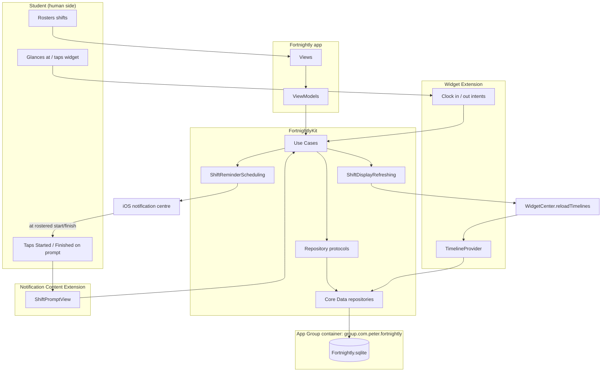
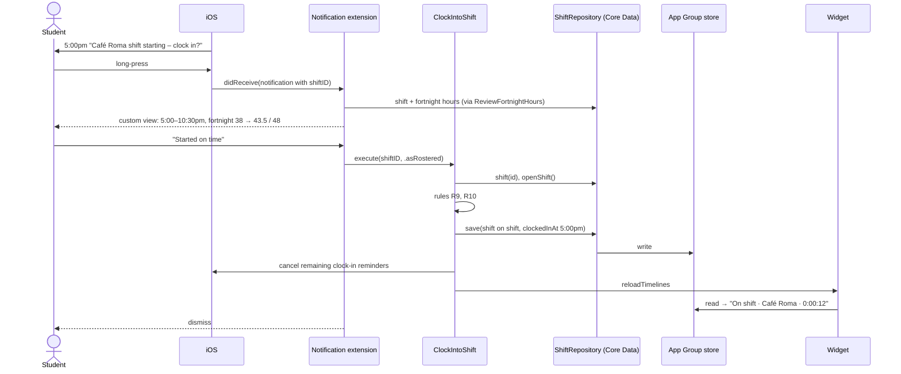

# Fortnightly — Project Plan

> Working name: **Fortnightly**. Rename freely; update bundle IDs and the App Group to match.

A shift-hours tracker for international students working casual jobs in Australia. Students roster their shifts up front; the app prompts them to clock in and out at the rostered times, keeps an accurate record across all employers, and warns them before and after they go past the student visa work limit of 48 hours per fortnight.

---

## 0. Decisions at a glance

| Decision | Choice |
|---|---|
| Stakeholder | An international student on a Student visa (subclass 500) working casual shifts for one or more employers during semester |
| Extension 1 | **Notification Content Extension**: clock-in and clock-out prompts showing the shift and its effect on the fortnight |
| Extension 2 | **WidgetKit Widget**: shift status (next / clock in due / on shift / clock out due) and fortnight hours, with interactive Clock in / Clock out buttons |
| Database | **Core Data**, store inside the App Group container |
| Platform | iOS 17.0+ (interactive widgets, `@Observable`), SwiftUI, Swift Testing |
| Shared code | `FortnightlyKit` framework target (Domain, Use Cases, Persistence, Platform), linked by the app and both extensions |
| App Group | `group.com.peter.fortnightly` |
| Bundle IDs | App `com.peter.fortnightly` · Widget `com.peter.fortnightly.ShiftStatusWidget` · Notification `com.peter.fortnightly.ShiftPromptNotification` |
| Out of scope | Payslip parsing, checking pay rates against the award (casual loading, penalty rates), cloud sync |

---

## 1. Problem and evidence (feeds Section 1)

### Draft problem statement

International students on a Student visa may work at most **48 hours in any fortnight** while their course is in session. Home Affairs defines a fortnight as 14 days starting on **any** Monday, so the limit applies to overlapping (rolling) fortnights, not fixed pay cycles. A student can break the limit in weeks 2–3 even if weeks 1–2 and 3–4 each look fine. Students typically work irregular casual shifts (late closes, early openings, last-minute extra shifts) for more than one employer, and no single employer or payroll system sees their combined hours.

Two things go wrong:

1. **Visa risk:** students lose track of combined hours across employers and rolling fortnights, accept one more shift, and breach condition 8105. The consequence can be visa cancellation.
2. **No independent record:** students rely on their employer's records to know what they worked. Underpayment of international students is widespread, and the deeper the underpayment, the more likely payslips are missing or falsified. Without their own record, a student can't check their payslip or back up a complaint.

The two problems feed each other. Students who suspect they've gone over their hours are afraid to report underpayment, because the labour regulator can share information with immigration authorities. Keeping within the limit **and** keeping an accurate record of their own is what lets a student safely ask to be paid properly.

**Primary stakeholder:** an international student on a subclass 500 visa, studying full-time in Sydney, working 2–4 casual hospitality shifts a week for one or two employers, with rosters sent weekly by text or a rostering app.

**Draft persona (replace with real interview data):** Linh, 23, Master of IT student. She works at a café (weekday mornings) and a restaurant (Friday and Saturday closes, often finishing after midnight). Shifts are added by text message. She tracks her hours roughly in her head, and has accepted extra shifts without knowing whether that fortnight was already near 48.

### Sources

| Source | What it evidences |
|---|---|
| Department of Home Affairs, [Work restrictions for student visa holders](https://immi.homeaffairs.gov.au/visas/getting-a-visa/visa-listing/student-500/temporary-relaxation-of-working-hours-for-student-visa-holders) | 48 hrs per fortnight from 1 July 2023 while the course is in session. "A fortnight is a period of 14 days starting on a Monday." Their worked example: a breach in "the fortnight comprising the 14 days of weeks 2 and 3 (60 hours worked)". No restriction when the course is not in session. Research masters and doctoral students are exempt. *The page returned HTTP 401 to automated fetch; open it in a browser and quote it directly.* |
| Farbenblum & Berg (2020), *International Students and Wage Theft in Australia*; [UNSW news summary](https://www.unsw.edu.au/news/2020/07/wage-theft-rife-for-international-students-in-australia) | Survey of 5,000 students: more than 3 in 4 earn below the minimum casual wage. Almost two-thirds didn't seek help, "often because of visa concerns". "There's nothing to stop the labour regulator sharing information with immigration authorities if a student has worked more hours than her visa allows." |
| Migrant Justice Institute (2026), *Off the Books*; [UNSW newsroom, 7 May 2026](https://www.unsw.edu.au/newsroom/news/2026/05/survey-hidden-system-migrant-worker-exploitation) | 9,963 responses. 65% of migrant employees paid below their legal entitlements. International students short-changed about $3.18 billion a year. The more underpaid, the more likely they receive fraudulent or no payslips. Workers fear "immigration consequences". |
| Fair Work Ombudsman, [Record My Hours: how the app works](https://www.fairwork.gov.au/tools-and-resources/record-my-hours-app/how-the-app-works) | The existing tool: records hours automatically by location (needs "Always" location access) or manually. FWO itself notes iPhone automatic recording can fail when the app has been in the background for a long time, and that it isn't suitable where there's no coverage. Its help page does not mention visa work limits. *Install it and confirm before writing the comparison.* |

Laurie Berg, one of the report authors, is at **UTS Law**. Worth mentioning, and possibly worth contacting.

### Interviews (strongly recommended)

Talk to 3–5 international students with casual jobs. Ask for their consent, keep them anonymous, and check with your tutor whether a consent form is expected.

1. How many employers do you work for? How do rosters reach you (text, app, email)?
2. How do you keep track of your hours today? Have you ever been unsure whether you were near 48?
3. Have you been offered an extra shift and accepted without checking?
4. Have you ever forgotten what time you actually finished?
5. Do you get payslips? Have you ever found a mismatch with what you worked?
6. Would a Lock Screen widget or a prompt at the end of each shift fit how you use your phone at work?

Record quotes and numbers ("3 of 5 had no written record"). They make Section 1 and the reflection much stronger.

---

## 2. Design justification notes (feeds Section 2)

**Why an iOS app**
- The record must be made **at work, at the moment a shift starts or ends**. The phone is the only device on the student's person.
- **Local notifications** fire at rostered times without a server, and work with no signal (basement kitchens).
- **The Lock Screen and Home Screen widget** shows status without unlocking or opening anything.
- **Offline-first, on-device storage** suits sensitive visa and work data.
- **Why not a website:** it can't prompt at shift times or sit on the Lock Screen, and needs connectivity.
- **Why not employer rostering apps (Deputy, etc.):** each covers one employer, records are controlled by the employer, and none combines hours across employers or applies the visa rule.
- **Why not FWO Record My Hours:** it relies on background location (FWO documents reliability limits on iPhone) and doesn't plan against the 48-hour limit. Fortnightly is driven by the roster, so it needs **no location permission**, and it warns **before** a shift is accepted.

**Why these extensions**
- **Notification Content Extension:** the student's attention is on work, not on an app, when a shift starts at 6am or ends at 1am. The prompt comes to them. The custom view shows **what this shift does to the fortnight** (38 → 43.5 of 48 hrs), which a plain notification cannot. Removing it means clocking depends on memory, which is the failure being solved.
- **Widget:** notifications get buried. The widget keeps showing "Not clocked in" or "Still on shift" every time the student glances at their phone, until it's fixed, and lets them fix it with one tap. Because shifts are rostered in advance, the widget schedules its own state changes (next shift → clock in due → on shift) without the app running.

**Why Core Data (not CloudKit)**
- The data is **private and sensitive**: visa compliance and work hours. Given the documented fear of information reaching immigration authorities, keeping it on the device is a feature.
- It must work **offline** at work.
- It must be **fast and local** for the widget and the notification extension, which read it from the shared App Group container.
- **Nothing needs sharing or syncing:** one student, one phone.
- **Trade-off to acknowledge:** losing the phone loses the record. Mitigation: a CSV export (stretch).

---

## 3. Domain language

Use these words in type names, properties, labels and errors. Avoid `Item`, `Entry`, `Data`, `Manager`, `Record` (except Core Data entities).

| Term | Meaning |
|---|---|
| Employer | A business the student works for |
| Shift | One block of work for one employer |
| Roster / rostered | The planned start and finish the employer gave |
| Clock in / clock out | Confirming when work actually started or finished |
| On shift | Clocked in and not yet clocked out |
| Worked shift | A shift with an actual clock-in and clock-out |
| Not worked | A rostered shift that didn't happen (cancelled or swapped) |
| Work fortnight | 14 days starting on a Monday (00:00 Monday to 00:00 Monday two weeks later) |
| Work limit | 48 hours per work fortnight while the course is in session |
| Course break | Dates when the course is not in session; the limit does not apply |
| Pay period | The employer's pay cycle (weekly or fortnightly), used to compare against payslips |

---

## 4. Domain rules

| # | Rule | Source / reason |
|---|---|---|
| R1 | At most 48 hours in any work fortnight while the course is in session | Home Affairs, condition 8105 |
| R2 | A work fortnight starts on **any** Monday, so every week belongs to two fortnights | Home Affairs definition and the weeks 2–3 example |
| R3 | Exactly 48.0 hrs is within the limit; anything above is a breach | "at most 48" |
| R4 | Hours worked on course-break days don't count towards the limit | Home Affairs: no restriction when not in session. *Partial-overlap handling is our interpretation; state it in the doc.* |
| R5 | Hours count where they fall in time: a shift crossing Sunday midnight is split across both weeks (interval overlap, not per-shift attribution) | Follows from R2 |
| R6 | Hours are real elapsed time; a shift over the daylight-saving change counts actual hours | Accuracy |
| R7 | Shifts cannot overlap each other, across any employers | You can't be at two shifts |
| R8 | A rostered shift longer than 14 hours is rejected as a likely AM/PM mistake; a worked shift longer than 16 hours means a forgotten clock-out | Data quality (product rule) |
| R9 | Only one shift can be on shift at a time | Follows from R7 |
| R10 | Clock-in no earlier than 60 minutes before the rostered start, and not after the rostered finish | Catches clocking into the wrong shift |
| R11 | "Approaching the limit" at 40 hrs or more (amber) | Product rule |
| R12 | Research masters and doctoral students: the work limit is off (a setting) | Home Affairs exemption |

The app must say it isn't legal advice: "Fortnightly helps you track your hours. Check your visa conditions in VEVO."

**Implementation trap:** Calendar weeks depend on the region. US-style regions start weeks on Sunday. Always build fortnights from a `Calendar` with `firstWeekday = 2` (Monday), and test it.

---

## 5. Architecture

### Layers

```
Views (SwiftUI)                    — app target
  ↓ observes
ViewModels (@Observable, @MainActor) — app target
  ↓ calls
Use Cases (structs)                — FortnightlyKit/UseCases
  ↓ depend on protocols (ports)
Repositories + platform ports      — FortnightlyKit/Ports (protocols)
  ↓ implemented by
Core Data repositories, reminder scheduler, widget refresher — FortnightlyKit/Persistence, /Platform
  ↓
SQLite store in App Group container  ← also read and written by both extensions through the same Use Cases
```

**Layering rules**
- Views never touch use cases or repositories, only their ViewModel.
- ViewModels call **use cases** for every operation with a business rule. Plain lookups with no rules (the employer list for a picker) may go through a **repository protocol**. Nothing above Persistence imports `CoreData`. Record this decision in the README.
- Use cases depend only on protocols and Domain types, which makes them testable with mocks.
- Extensions reuse the **same use cases** as the app. The widget's Clock in button runs `ClockIntoShift`, not its own logic.

### Targets

| Target | Contains | Links |
|---|---|---|
| `Fortnightly` (app) | Views, ViewModels, `AppDependencies` (composition root), `AppDelegate` (notification delegate) | FortnightlyKit (Embed & Sign) |
| `FortnightlyKit` (framework) | Domain, Ports, UseCases, Persistence (incl. `Fortnightly.xcdatamodeld`), Platform | — |
| `ShiftStatusWidgetExtension` (widget extension, folder `ShiftStatusWidget/`) | TimelineProvider, widget views, `ClockIntoShiftIntent`, `ClockOutOfShiftIntent` | FortnightlyKit (Do Not Embed) |
| `ShiftPromptNotification` (notification content ext.) | `NotificationViewController`, `ShiftPromptView` | FortnightlyKit (Do Not Embed) |
| `FortnightlyKitTests` | Use case tests, mocks | FortnightlyKit |

All three executables have the **App Groups** capability with `group.com.peter.fortnightly`.

### Folder layout

```
Fortnightly/
  App/            FortnightlyApp.swift, AppDelegate.swift, AppDependencies.swift
  Features/
    Today/        TodayView, TodayViewModel
    Roster/       RosterView, RosterViewModel, RosterShiftView, RosterShiftViewModel, ShiftDetailView, ShiftDetailViewModel
    Hours/        FortnightHoursView, FortnightHoursViewModel, PayPeriodHoursView (+VM)
    Employers/    EmployersView, EmployerFormView (+VMs)
    CourseBreaks/ CourseBreaksView (+VM)
    Onboarding/   OnboardingView (+VM)
FortnightlyKit/
  Domain/         Employer, Shift, ShiftStatus, WorkFortnight, FortnightWorkSummary, CourseBreak, WorkLimitPolicy, ShiftTimesPolicy, PayPeriod
  Ports/          ShiftRepository, EmployerRepository, CourseBreakRepository, ShiftReminderScheduling, ShiftDisplayRefreshing, CurrentTimeProvider
  UseCases/       RosterShift, ClockIntoShift, ClockOutOfShift, MarkShiftNotWorked, ReviewFortnightHours, RecordCourseBreak, LogPastShift, ComparePayslipHours
  Persistence/    Fortnightly.xcdatamodeld, ShiftStore (container setup), CoreDataShiftRepository, CoreDataEmployerRepository, CoreDataCourseBreakRepository, mapping
  Platform/       AppGroup, LocalShiftReminderScheduler, WidgetShiftDisplayRefresher, ShiftPromptCategory
ShiftStatusWidget/
ShiftPromptNotification/
FortnightlyKitTests/
  Mocks/          InMemoryShiftRepository, InMemoryEmployerRepository, InMemoryCourseBreakRepository, SpyReminderScheduler, FixedTime
```

### Diagram sketch (redraw in draw.io for Section 3)



### Primary use case flow (clock in from the start prompt)



---

## 6. Data model (Core Data)

Entities use the `Entity` suffix and stay inside `Persistence/`. They are mapped to and from Domain structs; nothing outside Persistence sees an `NSManagedObject`.

### `EmployerEntity`
| Attribute | Type | Notes |
|---|---|---|
| id | UUID | |
| name | String | |
| payCycle | String | `weekly` / `fortnightly` / `monthly` |
| payCycleAnchor | Date | Any known pay-period start date |
| isArchived | Bool | Employers holding hours are archived, never deleted |
| createdAt | Date | |
| shifts | → ShiftEntity, to-many | Inverse `employer`, delete rule **Deny** (protects the hours record) |
| payslipChecks | → PayslipCheckEntity, to-many | Inverse `employer`, delete rule Cascade (stretch) |

### `ShiftEntity`
| Attribute | Type | Notes |
|---|---|---|
| id | UUID | |
| rosteredStart | Date | Indexed |
| rosteredFinish | Date | |
| clockedInAt | Date? | |
| clockedOutAt | Date? | |
| status | String | `rostered` / `onShift` / `worked` / `notWorked`, indexed |
| note | String? | |
| employer | → EmployerEntity, to-one, required | Delete rule Nullify |

### `CourseBreakEntity`
`id` UUID · `name` String ("Summer break") · `startsOn` Date · `endsOn` Date

### `PayslipCheckEntity` (stretch)
`id` · `payPeriodStart` · `payPeriodEnd` · `hoursPaid` Double · `checkedAt` · `employer` → EmployerEntity

### Domain queries (predicates)

| Repository method | Predicate | Domain meaning |
|---|---|---|
| `openShift()` | `status == "onShift"` | The shift the student is currently on |
| `upcomingShifts(after:)` | `status == "rostered" AND rosteredFinish > %@`, sorted by `rosteredStart` | What's coming up |
| `shiftsAwaitingClockIn(asOf:)` | `status == "rostered" AND rosteredStart < %@` | Shifts that started without a clock-in |
| `shiftsCountingTowardWorkLimit(overlapping:)` | `status != "notWorked" AND ((clockedInAt != nil AND clockedInAt < %@ AND (clockedOutAt == nil OR clockedOutAt > %@)) OR (clockedInAt == nil AND rosteredStart < %@ AND rosteredFinish > %@))` | Every shift whose hours fall inside a work fortnight |
| `shiftsOverlapping(_:excluding:)` | Same overlap test plus `id != %@` | Rule R7 |
| `workedShifts(for:overlapping:)` | `employer.id == %@ AND status == "worked" AND clockedInAt < %@ AND clockedOutAt > %@` | Hours for one employer's pay period |

### Store setup (App Group)

```swift
enum AppGroup {
    static let identifier = "group.com.peter.fortnightly"
    static var containerURL: URL {
        FileManager.default.containerURL(forSecurityApplicationGroupIdentifier: identifier)!
    }
}

// ShiftStore.swift — load the model ONCE (static), or tests will warn about duplicate entity classes.
let description = NSPersistentStoreDescription(url: AppGroup.containerURL.appending(path: "Fortnightly.sqlite"))
description.setOption(true as NSNumber, forKey: NSPersistentHistoryTrackingKey)
description.setOption(true as NSNumber, forKey: NSPersistentStoreRemoteChangeNotificationPostOptionKey)
// viewContext.automaticallyMergesChangesFromParent = true
// viewContext.mergePolicy = NSMergeByPropertyObjectTrumpMergePolicy
```

- The model lives in the framework, so load it with `Bundle(for: ShiftStore.self)`.
- Repositories wrap every call in `context.performAndWait { }`, so they are safe whether called from a ViewModel (main actor) or an App Intent (background).
- **Changes made by the extensions:** the widget and notification extension write from another process. The app re-fetches when it comes to the foreground (`scenePhase == .active`) and on `.NSPersistentStoreRemoteChange`.

---

## 7. Ports (protocols)

```swift
protocol ShiftRepository {
    func shift(withID id: Shift.ID) throws -> Shift?
    func openShift() throws -> Shift?
    func upcomingShifts(after date: Date) throws -> [Shift]
    func shiftsAwaitingClockIn(asOf date: Date) throws -> [Shift]
    func shiftsCountingTowardWorkLimit(overlapping interval: DateInterval) throws -> [Shift]
    func shiftsOverlapping(_ interval: DateInterval, excluding id: Shift.ID?) throws -> [Shift]
    func workedShifts(for employerID: Employer.ID, overlapping interval: DateInterval) throws -> [Shift]
    func save(_ shift: Shift) throws
}

protocol EmployerRepository {
    func employers(includingArchived: Bool) throws -> [Employer]
    func employer(withID id: Employer.ID) throws -> Employer?
    func save(_ employer: Employer) throws
}

protocol CourseBreakRepository {
    func courseBreaks(overlapping interval: DateInterval) throws -> [CourseBreak]
    func allCourseBreaks() throws -> [CourseBreak]
    func save(_ courseBreak: CourseBreak) throws
    func remove(_ id: CourseBreak.ID) throws
}

protocol ShiftReminderScheduling {          // implemented with UNUserNotificationCenter
    func scheduleReminders(for shift: Shift, employerName: String)
    func cancelClockInReminders(for shiftID: Shift.ID)
    func cancelAllReminders(for shiftID: Shift.ID)
    func snoozeClockOutReminder(for shift: Shift, by minutes: Int)
}

protocol ShiftDisplayRefreshing {           // implemented with WidgetCenter
    func shiftsDidChange()
}

protocol CurrentTimeProvider { var now: Date { get } }   // fixed in tests
```

`FortnightWorkSummary` and the fortnight maths are **pure Domain code** (`WorkFortnight`, `WorkLimitPolicy`), so they're testable with no mocks at all.

---

## 8. Use cases

Pattern: a struct whose dependencies are protocols, an `execute` method, and a typed error enum conforming to `LocalizedError` with `errorDescription` (what went wrong) and `recoverySuggestion` (what to do next). ViewModels show both.

```swift
struct RosterShift {
    let shifts: ShiftRepository
    let employers: EmployerRepository
    let courseBreaks: CourseBreakRepository
    let reminders: ShiftReminderScheduling
    let display: ShiftDisplayRefreshing
    let time: CurrentTimeProvider

    func execute(_ request: ShiftRosterRequest) throws(RosterShiftError) -> Shift { … }
}
```

Every **mutating** use case calls `display.shiftsDidChange()` (which reloads the widget) and updates reminders. That covers "the main app calls the WidgetCenter reload API after every relevant data change".

### Priority

| Priority | Use case | Why |
|---|---|---|
| Must | `RosterShift`, `ClockIntoShift`, `ClockOutOfShift`, `ReviewFortnightHours` | The core loop; covers the assignment minimum of 3 |
| Should | `MarkShiftNotWorked`, `LogPastShift`, `RecordCourseBreak` | Notification "Not working" action, forgotten shifts, rule R4 |
| Could | `ComparePayslipHours` | Payslip comparison without parsing |

### `RosterShift`: add or edit an upcoming shift
- **Input:** employerID, start, finish, note, optional existing shiftID, `acknowledgingWorkLimitBreach: Bool`
- **Rules:**
  - R7 no overlap.
  - R8 at most 14 hrs.
  - Finish after start.
  - The shift must not have already finished (use Log Past Shift instead).
  - Only `rostered` shifts can be edited.
  - R1–R5 projected fortnight hours for **every** fortnight the shift touches.
- **Output:** saved `Shift`; reminders scheduled.
- **Warn, don't block.** A shift that pushes a fortnight over the limit throws `wouldBreachWorkLimit` unless acknowledged. Refusing to save a real shift would make the record dishonest; the student decides after being warned. (Good "architecture under pressure" material.)

| Error case | errorDescription | recoverySuggestion |
|---|---|---|
| `finishesBeforeStart` | This shift finishes before it starts. | For a shift that ends after midnight, set the finish to the next day. |
| `tooLong(hours:)` | This shift would be 18 hours long. | Check AM/PM on the start and finish. Shifts longer than 14 hours can't be rostered. |
| `overlaps(employerName:, timeRange:)` | This overlaps your Café Roma shift (Sat 5:00–10:30pm). | You can't be at two shifts at once. Change these times or edit the other shift. |
| `alreadyFinished` | This shift has already finished. | Add hours you've already worked with **Log a past shift** in Shift History. |
| `alreadyClockedIn` | You've already clocked in to this shift, so its rostered times can't change. | Correct the actual hours from the shift's details after you clock out. |
| `employerUnavailable` | This employer has been archived. | Choose another employer or restore them in Employers. |
| `wouldBreachWorkLimit(fortnight:, projectedHours:)` | This shift would take you to 50.5 of 48 hours for Mon 7 Oct – Sun 20 Oct. | Your student visa allows 48 hours a fortnight during semester. Ask your manager to shorten or swap this shift. You can still save it so your record stays accurate. |
| `recordsUnavailable` | Your shift couldn't be saved right now. | Your other shifts are safe. Try again; if it keeps happening, restart the app. |

### `ClockIntoShift`
- **Input:** shiftID, `ClockInTime` = `.asRostered` | `.now` | `.at(Date)`
- **Rules:** shift is `rostered`; R9 no other open shift; R10 time window; clock-in time not in the future.
- **Side effects:** cancel the remaining clock-in reminders for this shift; refresh the widget.

| Error case | errorDescription | recoverySuggestion |
|---|---|---|
| `anotherShiftInProgress(employerName:, since:)` | You're still clocked in at Café Roma (since 5:02pm). | Clock out of that shift first, then clock in here. |
| `alreadyClockedIn(since:)` | You clocked in to this shift at 5:02pm. | Nothing to do: your hours are being tracked. |
| `markedNotWorked` | You marked this shift as not worked. | If you did work it, restore it from the shift's details. |
| `tooEarly(rosteredStart:)` | This shift isn't rostered to start until 5:00pm. | You can clock in up to 1 hour early. If your start time changed, edit the shift first. |
| `afterRosteredFinish(rosteredFinish:)` | That's after this shift was rostered to finish (10:30pm). | Choose "Started on time", or edit the shift if it was moved. |
| `timeInFuture` | You can't clock in at a time that hasn't happened yet. | Choose "Started just now". |
| `shiftNotFound` | This shift no longer exists. | Check your upcoming shifts in Roster. |
| `recordsUnavailable` | Your clock-in couldn't be saved. | Try again. If it fails, note your start time and add it later from Shift History. |

### `ClockOutOfShift`
- **Input:** shiftID, `ClockOutTime` = `.asRostered` | `.now` | `.at(Date)`
- **Rules:** shift is `onShift`; finish after clock-in; not in the future; R8 at most 16 hrs worked.
- **Output:** `ClockOutOutcome(workedShift, fortnights: [FortnightWorkSummary])`. If a fortnight is now over the limit, the UI shows a **warning**, not an error: the hours happened, and the record must say so.
- **Side effects:** cancel all reminders for this shift; refresh the widget.

| Error case | errorDescription | recoverySuggestion |
|---|---|---|
| `notClockedIn` | You're not clocked in to this shift. | If you worked it, add it with **Log a past shift**. |
| `finishBeforeClockIn(clockedInAt:)` | That finish time is before you clocked in (5:02pm). | Pick a time after 5:02pm. |
| `rosteredFinishNotReached(rosteredFinish:)` | Your rostered finish (10:30pm) hasn't happened yet. | If you finished early, choose "Finished just now". |
| `timeInFuture` | You can't clock out at a time that hasn't happened yet. | Choose "Finished just now", or wait until you finish. |
| `unusuallyLong(hours:)` | That would record a 19-hour shift. | If you forgot to clock out, enter the time you actually finished. |
| `shiftNotFound` / `recordsUnavailable` | (as above, in clock-out wording) | |

### `ReviewFortnightHours`
- **Input:** a date (usually today)
- **Rules:** R1–R6, R11, R12. Returns a summary for **both** work fortnights containing the date (the one starting this Monday and the one starting last Monday). Each summary has worked, on-shift and rostered hours, remaining hours, course-break exemption, and status (`withinLimit` / `approachingLimit` / `overLimit` / `noLimit`).
- Used by the Today screen, the Hours screen, the widget and the notification view.

| Error case | errorDescription | recoverySuggestion |
|---|---|---|
| `recordsUnavailable` | Your fortnight hours couldn't be worked out right now. | Your shifts are safe. Close and reopen the app; if it continues, restart your phone. |
| `shiftLeftOpen(employerName:, since:)` | Your Café Roma shift has been clocked in since Sat 5:02pm, so this total may be wrong. | Clock out with the time you actually finished. |

### `MarkShiftNotWorked` (should)
- **Rules:** only `rostered` shifts. Cancels the shift's reminders and removes it from the projections.
- **Errors:** `alreadyClockedIn`, `alreadyWorked`, `shiftNotFound`, `recordsUnavailable`

### `LogPastShift` (should)
- Records a finished shift directly as worked.
- **Rules:** finish in the past; R7; R8 (16 hrs); employer exists. Returns fortnight summaries, so it can warn about the limit after the fact.
- **Errors:** `finishesBeforeStart`, `notFinishedYet`, `overlaps`, `unusuallyLong`, `recordsUnavailable`

### `RecordCourseBreak` (should)
- **Rules:** end after start; breaks don't overlap; at most 130 days (catches a typo in the year).
- **Errors:**
  - `endsBeforeItStarts`
  - `overlaps(breakName:)`: "This overlaps Summer break (16 Nov – 23 Feb)." / "Adjust the dates or edit Summer break."
  - `unrealisticallyLong(days:)`: "That break is 400 days long." / "Check the year on the end date."
  - `recordsUnavailable`

### `ComparePayslipHours` (could)
- **Input:** employerID, pay period (derived from the employer's pay cycle and anchor date), hours paid (typed in by the student)
- **Rules:** the period has ended; no shift in it is still open; hours paid is between 0 and 200.
- **Output:** hours worked vs hours paid, and the difference.
- **Errors:**
  - `payPeriodNotFinished(endsOn:)`: "This pay period doesn't end until Sun 20 Oct." / "Compare once it ends and your payslip arrives."
  - `noShiftsWorked(employerName:)`: "You haven't recorded any Café Roma shifts in this pay period." / "If you worked, add them with Log a past shift, then compare again."
  - `shiftStillOpen`
  - `hoursPaidOutOfRange`
- The result message (not an error): "Café Roma paid you for 22 hrs but you recorded 25.5 hrs. Raise it with your manager, or get free help from the Fair Work Ombudsman."

---

## 9. Screens and flow

The tab bar follows the student's week: plan → work → check.

| Tab / screen | Purpose | Use cases | Key states |
|---|---|---|---|
| **Onboarding** (first launch) | Explain the 48-hr fortnight, ask for notification permission, add the first employer, optionally set course breaks | — | Permission denied → explain that prompts won't appear and that the widget still helps |
| **Today** (tab) | Current shift card: next shift → **Clock in** → on shift with timer → **Clock out**. Banner for shifts awaiting clock-in. Fortnight meters for both current fortnights | ClockIntoShift, ClockOutOfShift, ReviewFortnightHours | Empty: "No shifts rostered. Add your next shift so Fortnightly can remind you to clock in." |
| **Roster** (tab) | Upcoming shifts grouped by Monday week, with week hours and a fortnight warning badge | ReviewFortnightHours | Empty: "Your roster is empty. Add shifts as soon as your manager sends them." |
| **Roster a Shift** (sheet) | Employer, date, start, finish. If the finish is earlier than the start, it's assumed to be the next day and labelled "Finishes Sun 1:00am". Live preview: "This fortnight: 38 → 44 / 48" | RosterShift | Over-limit confirmation dialog |
| **Shift Details** | Rostered vs actual times, status, edit, mark not worked, correct worked times | RosterShift, MarkShiftNotWorked | |
| **Hours** (tab) | Choose a work fortnight; daily bars, total vs 48, course-break shading, breakdown by employer; **Log a past shift** | ReviewFortnightHours, LogPastShift | |
| **Pay Period Hours** | Hours worked per employer per pay period, to hold against the payslip; optional hours-paid entry | ComparePayslipHours | |
| **Employers** (tab / settings) | Add, edit and archive employers; pay cycle | (repository read; archive rule) | Empty: "Add the places you work so your shifts add up across all of them." |
| **Course Breaks** | Semester break dates (limit off); research-degree toggle | RecordCourseBreak | |

Must-have screens to clear the 5-screen minimum: Today, Roster, Roster a Shift, Hours, Employers.

---

## 10. Notification Content Extension: `ShiftPromptNotification`

**Categories** (`ShiftPromptCategory`)

| Category | Fires at | Actions (default) |
|---|---|---|
| `SHIFT_START` | rostered start, then again at +20 min if still not clocked in | **Started on time** · **Started just now** · **Not working this shift** (destructive) |
| `SHIFT_FINISH` | rostered finish, then again at +45 min if still on shift | **Finished on time** · **Finished just now** · **Still working – remind me in 30 min** |

- **Payload:** `userInfo["shiftID"]`, `userInfo["prompt"]`
- **Identifiers:** `shift.<uuid>.clockInDue`, `.clockInOverdue`, `.clockOutDue`, `.clockOutOverdue`. These allow cancelling exactly the reminders that no longer apply.

**Info.plist (`NSExtensionAttributes`)**
- `UNNotificationExtensionCategory` = [`SHIFT_START`, `SHIFT_FINISH`]
- `UNNotificationExtensionInitialContentSizeRatio` = 0.6
- `UNNotificationExtensionDefaultContentHidden` = YES (the custom view replaces the default appearance)

**Custom view (`ShiftPromptView`, SwiftUI inside a `UIHostingController`)**
- Employer, rostered times, and a live elapsed timer if the student is on shift.
- **Fortnight meter for this shift:** "Mon 7 – Sun 20 Oct: 38.0 → 43.5 of 48 hrs".
- A red warning row if this shift takes a fortnight over the limit, or "Course break – no limit".
- **Stale prompts:** if the shift is already clocked in or out (e.g. done from the widget), the view says "Already clocked in at 5:02pm ✓" and offers no actions.

**Actions**
- **Dynamic labels:** in `didReceive(_ notification:)`, set `extensionContext?.notificationActions` to labels with real times: "Started at 5:00pm", "Finished at 10:30pm".
- **Handling:** `didReceive(_ response:completionHandler:)` runs the shared use case (`ClockIntoShift`, `ClockOutOfShift`, `MarkShiftNotWorked`), shows "Clocked in ✓" briefly, then `.dismiss`.
- **Same path in the app:** the `AppDelegate`'s `UNUserNotificationCenterDelegate` routes actions through the same `ShiftPromptResponder` (in the Kit), so behaviour is identical wherever the action lands.
- **Errors in the extension** (e.g. another shift is still open): show the error's description and suggestion in the view, and don't dismiss.

**Testing in the Simulator**
- Debug-only button on Today: "Roster a test shift starting in 1 minute".
- Or push a payload straight to the Simulator: `xcrun simctl push booted com.peter.fortnightly prompt.apns` with `"aps": {"alert": {...}, "category": "SHIFT_START"}, "shiftID": "<uuid>"`.

---

## 11. Widget Extension: `ShiftStatusWidget`

**Families:** `.systemSmall`, `.accessoryRectangular`, `.accessoryCircular` (fortnight gauge). Optional: `.systemMedium`.

**States (`ShiftStatusEntry.state`)**

| State | When | Small / Rectangular shows | Button |
|---|---|---|---|
| `nothingRostered` | No upcoming shifts | "No shifts rostered" + fortnight hours | — |
| `nextShift` | Next shift in the future | "Next: Café Roma · Sat 5:00pm" + "38 / 48 hrs" | — |
| `clockInDue` | Rostered start passed, not clocked in | "Café Roma started 5:00pm · Not clocked in" | **Clock in** |
| `onShift` | Clocked in | "On shift · Café Roma" + `Text(clockedInAt, style: .timer)` | **Clock out** |
| `clockOutDue` | Rostered finish passed, still on shift | "Rostered finish 10:30pm · Still clocked in" | **Clock out** |

The circular widget is a `Gauge` of hours / 48, coloured by status (within / approaching / over).

**Timeline provider**
- Builds entries for the next 24 hrs at: now, each rostered start, start + 20 min, rostered finish, finish + 45 min.
- Policy: `.after(next significant date, or 1 hr)`.
- **The timer counts live** with `Text(_, style: .timer)`, so no reload is needed while on shift.
- Data comes through `ShiftRepository` and `ReviewFortnightHours` on the App Group store.

**Interactive buttons (iOS 17+)**
- `Button(intent: ClockIntoShiftIntent(shiftID:))` and `ClockOutOfShiftIntent`. These are App Intents in the widget target whose `perform()` runs the **same use case**.
- Widget buttons can't show alerts, so only buttons valid for the current state are shown. If a use case still fails, the reloaded widget shows the true state.

**Reload triggers**
- Every mutating use case calls `ShiftDisplayRefreshing.shiftsDidChange()`, which runs `WidgetCenter.shared.reloadTimelines(ofKind: "ShiftStatusWidget")`. This covers the app, the notification extension and the intents.

---

## 12. Reminder scheduling

- iOS keeps at most **64 pending local notifications** per app. Up to 4 reminders per shift means keeping a rolling window of the **next 10 shifts** (40 reminders).
- **Reschedule the window** on: app launch and foreground, any roster change, clock in/out, and marking a shift not worked.
- **Cancel by identifier** when the state changes: clocking in cancels `clockInDue` and `clockInOverdue`; clocking out or marking not worked cancels everything for that shift.
- **"Still working":** schedule a `SHIFT_FINISH` reminder 30 min from now.
- **Verify in the spike:** whether `UNUserNotificationCenter.current()` can cancel the app's pending reminders when called from the widget extension (an App Intent). Fallback: the app reconciles reminders on its next foreground, and the notification view handles stale prompts gracefully (section 10).

---

## 13. Unit tests (Swift Testing, mock repositories)

All tests use `InMemoryShiftRepository` (and the other in-memory mocks), `SpyReminderScheduler`, a fixed `CurrentTimeProvider`, and a `Calendar` set to `Australia/Sydney` with Monday as the first weekday. No Core Data.

| # | Test (domain-language name) | Kind |
|---|---|---|
| 1 | Rostering a shift that overlaps another employer's shift is rejected | Error |
| 2 | Rostering a shift that takes a fortnight past 48 hours needs acknowledgement | Error / rule |
| 3 | Rostering a shift that brings a fortnight to exactly 48 hours is allowed | Boundary |
| 4 | Rostering a shift longer than 14 hours is rejected as a likely AM/PM mistake | Error |
| 5 | Shifts during a course break don't count towards the work limit | Rule |
| 6 | Clocking in "on time" records the rostered start, not the time of the tap | Happy path |
| 7 | Clocking in while another shift is still open is rejected | Error |
| 8 | Clocking out before the clock-in time is rejected | Error |
| 9 | Clocking out of a shift left open for 19 hours asks for the real finish time | Boundary / error |
| 10 | Hours worked in weeks 2 and 3 breach the limit even though weeks 1–2 and 3–4 are under (the Home Affairs example) | Rule |
| 11 | A shift crossing Sunday midnight is split across both weeks | Boundary |
| 12 | Work fortnights start on Monday even when the phone's region starts weeks on Sunday | Boundary |
| 13 | A shift over the daylight-saving change counts the hours actually worked | Boundary |

Example name style: `@Test("Clocking in while another shift is still open is rejected")`.

Optional integration test (separate target, in-memory store at `/dev/null`): check that the Core Data overlap predicate agrees with the mock's overlap logic. The required tests stay on mocks.

---

## 14. Project setup (done, `chore/project-setup`)

Created in Xcode 27 (new projects start as an untitled draft; targets added via File → New → Target), then configured in the project file:

| Target | Bundle ID | Notes |
|---|---|---|
| `Fortnightly` | `com.peter.fortnightly` | iPhone only, embeds FortnightlyKit and both extensions. Default actor isolation MainActor (SwiftUI). |
| `FortnightlyKit` | `com.peter.fortnightly.FortnightlyKit` | `APPLICATION_EXTENSION_API_ONLY = YES`, nonisolated by default, library evolution off |
| `FortnightlyKitTests` | `com.peter.fortnightly.FortnightlyKitTests` | Swift Testing, hosted in the app |
| `ShiftStatusWidgetExtension` | `com.peter.fortnightly.ShiftStatusWidget` | Links FortnightlyKit (not embedded) |
| `ShiftPromptNotification` | `com.peter.fortnightly.ShiftPromptNotification` | Links FortnightlyKit (not embedded); categories `SHIFT_START`, `SHIFT_FINISH`; default content hidden; size ratio 0.6 |

- **All targets:** iOS 17.0 minimum (set once at the project level), iPhone only.
- **App Group:** `group.com.peter.fortnightly` in `Fortnightly.entitlements`, `ShiftStatusWidget.entitlements` and `ShiftPromptNotification.entitlements`.
- **No Team needed for the Simulator.** Simulator builds carry the App Group as simulated entitlements. Add a Team (Xcode → Settings → Accounts) only to run on a real iPhone.
- **Shared scheme:** `Fortnightly` (committed in `xcshareddata`). ⌘R runs the app; ⌘U runs `FortnightlyKitTests`.
- **Use Core Data, not SwiftData.** SwiftData is built on Core Data, but the brief names Core Data explicitly; avoid the ambiguity.

---

## 15. Git plan

- `main` holds only stable, working code. Each branch below merges into main with `--no-ff` (or a PR) once it builds and its tests pass.
- Branches, in roughly this order:
  - `chore/project-setup`
  - `spike/app-group-extensions`
  - `feature/domain-model`
  - `feature/use-cases`
  - `feature/core-data-repositories`
  - `feature/roster-screens`
  - `feature/clocking-and-reminders`
  - `feature/notification-content-extension`
  - `feature/shift-status-widget`
  - `feature/fortnight-hours`
  - `feature/course-breaks`
  - `feature/payslip-comparison`
  - `docs/readme`
- Conventional Commits, examples:
  - `feat(roster): reject shifts that overlap another shift`
  - `feat(widget): add clock-out button while on shift`
  - `test(fortnight): cover breach across weeks 2 and 3`
  - `fix(notification): show already-clocked-in state for stale prompts`
  - `docs: add App Group identifier and setup steps to README`
- **README sections:** overview, domain context (condition 8105, the problem), architecture summary (layers, targets, diagram), extensions and their justification, why Core Data, App Group `group.com.peter.fortnightly`, setup and run steps (incl. how to trigger a test prompt), how to run the tests.

---

## 16. Build order

| # | Milestone | Done when |
|---|---|---|
| 1 | **Spike: de-risk the extensions** | App writes one shift to the App Group store; the widget displays it; a local notification with category `SHIFT_START` shows the custom content view in the Simulator. *Do this first: it's where projects fail.* |
| 2 | Domain + fortnight maths | `WorkFortnight`, `WorkLimitPolicy`, `ReviewFortnightHours` pass tests 10–13 |
| 3 | Use cases + mocks | Tests 1–9 pass |
| 4 | Core Data repositories | App uses the real store; data survives relaunch |
| 5 | Employers, Roster, Roster a Shift screens | Can roster shifts with a live fortnight preview |
| 6 | Today + clocking + reminders | Full loop in the app; reminders schedule and cancel |
| 7 | Notification Content Extension | Clock in/out from the prompt; Today updates on foreground |
| 8 | Widget + interactive intents | All widget states display; buttons clock in and out |
| 9 | Hours, Course Breaks, Onboarding | ≥5 polished screens |
| 10 | Stretch: Log Past Shift, Pay Period Hours, payslip comparison, CSV export | |
| 11 | README, diagram, PDF | All deliverables ready |

---

## 17. Risks

| Risk | Mitigation |
|---|---|
| App Group / signing trouble with your Apple ID team | Milestone 1 spike; test in the Simulator early |
| Widget shows "No data" during marking | Seed demo data from a debug menu; the widget's empty state says "No shifts rostered", never "No data" |
| Can't cancel reminders from an extension | Reconcile on app foreground; the notification view handles stale prompts |
| Extension can't see the app's latest changes, or vice versa | Persistent history tracking, re-fetch on foreground, `performAndWait` repositories |
| Fortnight bugs from region settings | Monday-first `Calendar`; tests 11–13 |
| Scope creep | Ship the Must use cases + 5 screens + both extensions before any Could item |
| Legal accuracy | Cite Home Affairs, label the course-break interpretation, show the "not legal advice" note |

---

## 18. Decision log

Kept in [`DECISIONS.md`](DECISIONS.md): dated entries for every design choice, research finding and AI interaction. It feeds the Reflective Report and the AI section.

---

## 19. Deliverables checklist

- [ ] PDF Section 1: problem, stakeholder, cost of the status quo, sources (+ interviews)
- [ ] PDF Section 2: why iOS, why each extension (with scenarios), why Core Data
- [ ] PDF Section 3: one-page diagram showing layers, App Group, human/system boundary, primary flow
- [ ] PDF Section 4: 700–900-word reflection
- [ ] App: ≥5 screens, ≥3 use cases with typed errors, Core Data with 2+ related entities, domain predicates, repository protocols
- [ ] Notification Content Extension works end to end (custom view + actions)
- [ ] Widget works end to end (≥2 families, App Group data, reloads after changes)
- [ ] ≥5 unit tests on mocks, named in domain language
- [ ] Git: feature branches, Conventional Commits, stable main, complete README
- [ ] Zipped Xcode project + repo link
