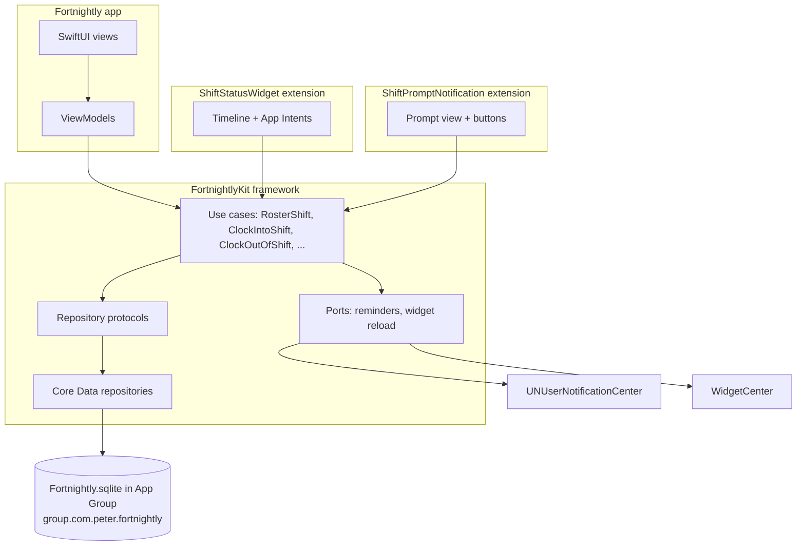

# Fortnightly

An iPhone app that keeps international students within the student visa work limit and gives them their own accurate record of the hours they worked.

The student enters each shift as their manager rosters it. Fortnightly shows what that shift does to the 48-hour limit before it's saved, prompts at the rostered start and finish to clock in and out, and keeps nagging from the widget until the shift is recorded. Everything stays on the phone.

UTS Assessment 3: Platform-Integrated iOS Application. The Required Document (problem statement, design justification, architecture diagram, reflective report) is [`report/Fortnightly-Report.pdf`](report/Fortnightly-Report.pdf).

## Domain context

International students on a Student visa (subclass 500) can work up to **48 hours a fortnight** while their course is in session ([Department of Home Affairs](https://immi.homeaffairs.gov.au/visas/getting-a-visa/visa-listing/student-500); visa condition 8105). The law defines a fortnight as "the period of 14 days commencing on a Monday" ([Migration Regulations 1994, Sch 8, condition 8105(3)](https://classic.austlii.edu.au/au/legis/cth/consol_reg/mr1994227/sch8.html)). Every Monday starts one, so fortnights overlap and every week belongs to two of them. Home Affairs' own example: 15, 30, 30 and 10 hours in four weeks is within the limit for weeks 1 and 2 (45 hours) and weeks 3 and 4 (40 hours), but may breach it in weeks 2 and 3 (60 hours) ([archived page, 2024](https://web.archive.org/web/20240730204044/https://immi.homeaffairs.gov.au/visas/getting-a-visa/visa-listing/student-500/temporary-relaxation-of-working-hours-for-student-visa-holders)).

**Primary stakeholder:** an international student studying full-time in Sydney, working two to four casual hospitality shifts a week for one or two employers, with rosters arriving by text message or a rostering app.

Two things go wrong for them:

1. **Visa risk.** No employer sees the student's combined hours, and pay cycles don't line up with the overlapping fortnights, so it's easy to accept one shift too many.
2. **No record of their own.** Underpayment of international students is widespread, and the more a worker is underpaid, the more likely their payslips are missing or false ([Farbenblum & Berg 2020](https://www.unsw.edu.au/news/2020/07/wage-theft-rife-for-international-students-in-australia); [Migrant Justice Institute 2026](https://www.unsw.edu.au/newsroom/news/2026/05/survey-hidden-system-migrant-worker-exploitation)). Without their own times, a student can't check a payslip or back up a complaint.

Fortnightly is driven by the roster, not by location: it needs no location permission and it plans against the visa rule before a shift is accepted. It is not legal advice; the app points students to VEVO for their own visa conditions.

## Architecture

SwiftUI Views → ViewModels → Use Cases → Repository protocols → Core Data. All business logic lives in the `FortnightlyKit` framework, which the app and both extensions link, so a clock-in from the widget or the notification runs exactly the same rules as one from the app.



| Layer | Where | What it holds |
|---|---|---|
| Views | `Fortnightly/Fortnightly/Features/` | Fortnight board, roster sheet, day sheet, shift details, Jobs, onboarding |
| ViewModels | `Features/*/…Model.swift`, `Shared/ShiftActions.swift` | Screen state; call use cases only, never Core Data |
| Domain | `FortnightlyKit/Domain/` | `Employer`, `Shift`, `CourseBreak`, `WorkFortnight`, `WorkLimitPolicy`, `FortnightWorkSummary`, `ShiftReminder` |
| Use cases | `FortnightlyKit/UseCases/` | One struct per business operation, each with a typed error enum |
| Ports | `FortnightlyKit/Ports/` | `ShiftRepository`, `EmployerRepository`, `CourseBreakRepository`, `ShiftReminderScheduling`, `ShiftDisplayRefreshing` |
| Persistence | `FortnightlyKit/Persistence/` | Core Data model and repositories |
| Platform | `FortnightlyKit/Platform/` | Notification scheduler, widget reloader, `FortnightlyServices` (wiring), `ShiftPromptResponder` |
| Display | `FortnightlyKit/Display/` | The donut, day bars and colours shared by the app, widget and prompt |

### Use cases and the rules they enforce

| Use case | Business rules | Typed error |
|---|---|---|
| `RosterShift` | No overlap with another shift (touching end to start is fine); at most 14 hours (catches AM/PM mistakes); not already finished; a shift that takes either fortnight over 48 hours needs the student's acknowledgement ("Add anyway") | `RosterShiftError` |
| `ClockIntoShift` | Only a rostered shift; no other shift still open; not more than 60 minutes before the rostered start; "on time" records the rostered start, not the tap | `ClockIntoShiftError` |
| `ClockOutOfShift` | Finish after the clock-in and not in the future; over 16 hours asks for the real finish; a breach is recorded and reported, never refused | `ClockOutOfShiftError` |
| `LogPastShift` | Past shifts, a missed shift's real times, or corrected times; no overlap; keeps the rostered times for payslip checks | `LogPastShiftError` |
| `ReviewFortnightHours` | Both fortnights containing a day, starting on Monday whatever the phone's region; hours split where they fall; course-break days excluded; exactly 48 is within the limit | `ReviewFortnightHoursError` |
| `MarkShiftNotWorked` | Only a shift not yet clocked into | `MarkShiftNotWorkedError` |
| `AddEmployer` | Name required and unique among current employers (ignoring case and accents); gets the first of six colours no current employer uses | `AddEmployerError` |
| `ArchiveEmployer` | Refused while on shift there or with upcoming shifts there; worked hours keep counting | `ArchiveEmployerError` |
| `RecordCourseBreak` | Breaks can't share a day (the last day is part of the break); at most 130 days | `RecordCourseBreakError` |
| `RefreshShiftReminders` | Prompts for the open shift and the next 10 shifts (iOS keeps at most 64 pending notifications) | `RefreshShiftRemindersError` |

Read-only use cases feed the screens: `ReviewFortnightDays`, `ReviewCurrentShift`, `ReviewMissedShifts`, `ReviewShift`, `ReviewJobs`. Every error message says what went wrong in the student's words and what to do next.

## Extensions and why

**Notification Content Extension (`ShiftPromptNotification`).** When a shift starts at 6am or ends after a 1am close, the student's attention is on work, not on an app. A prompt arrives at the rostered start ("Started 5:00 pm", "Started just now", "Not working this shift") and at the rostered finish ("Finished 10:30 pm", "Finished just now", "Still working"). The custom view shows the fortnight's donut, the hours so far and the shift's day, which a plain notification cannot. The buttons run the shared use cases in the background. Without it, clocking in depends on memory, which is the failure being solved.

**WidgetKit widget (`ShiftStatusWidget`).** Notifications get buried. The Home Screen widget keeps showing "Not clocked in", "On shift" or "Still clocked in" every time the student glances at their phone, with buttons to fix it in one tap: two clock-in buttons ("Started 5:00 pm" and "Just now", because the time of a tap isn't necessarily when work started) and a clock-out button. The Lock Screen rectangular and circular widgets show the state and the fortnight's hours without unlocking. Families: `.systemSmall`, `.accessoryRectangular`, `.accessoryCircular`. Every use case that changes shifts reloads the widget through `WidgetCenter`.

## Database: Core Data

Core Data, with the store in the App Group container so the app, the widget and the notification extension read and write the same records.

- **Private:** visa and work-hours data is sensitive, and students fear it reaching immigration authorities. It never leaves the phone; no account, no server.
- **Offline:** it must work in a basement kitchen with no signal.
- **Fast and local:** the widget and the notification extension read it directly.
- **No sync needed:** one student, one phone. CloudKit's strengths (sync and sharing) aren't needs here.

**Schema** (`FortnightlyKit/Persistence/Fortnightly.xcdatamodeld`):

| Entity | Attributes | Relationship |
|---|---|---|
| `EmployerEntity` | id, name, colour, payCycle, payCycleAnchor, isArchived, createdAt | `shifts` to-many, delete rule Deny (protects the hours record) |
| `ShiftEntity` | id, rosteredStart, rosteredFinish, clockedInAt, clockedOutAt, status (rostered / onShift / worked / notWorked), note | `employer` to-one, required |
| `CourseBreakEntity` | id, name, startsOn, endsOn | — |

Domain queries include `status == "onShift"` (the shift the student is on), `status == "rostered" AND rosteredFinish > now` (upcoming shifts), and the work-limit query: clocked-in shifts whose actual times overlap a fortnight **or** rostered shifts whose rostered times do, excluding shifts not worked.

**App Group identifier:** `group.com.peter.fortnightly`

## Setup

**Requirements:** Xcode 27 (the project was built with it), iOS 17 or later. Tested on the iPhone 17 Simulator with iOS 26.5. No Apple Developer Team is needed for the Simulator: the App Group is provided as simulated entitlements. To run on a real iPhone, choose a Team for the three targets (`Fortnightly`, `ShiftStatusWidgetExtension`, `ShiftPromptNotification`).

1. Clone the repository and open `Fortnightly/Fortnightly.xcodeproj`.
2. Choose the **Fortnightly** scheme and an iPhone Simulator, then Run (⌘R).
3. A fresh install starts with onboarding: the 48-hour rule, notifications, and your first employer.

### Sample data (recommended for marking)

The app ships with a debug-only sample roster: two employers (Café Roma and Thai Express) and a fortnight of shifts around today, including two jobs on one day, a shift yesterday that finished without a clock-in, and a shift that started five minutes ago so a clock-in is due.

- **Launch argument:** Product → Scheme → Edit Scheme → Run → Arguments, tick **`-sampleRoster`** (already listed, off by default), then Run. It skips onboarding.
- **Or in the app:** in onboarding step 3 choose "I'll add it later", then open Jobs and tap **Load sample shifts (testing only)**.

Sample data loads only when no employer exists, so it never mixes with a real record. To start again, delete the app from the Simulator (or `xcrun simctl uninstall booted com.peter.fortnightly`). Neither option exists in a Release build.

### Trying the extensions

- **Widget:** on the Home Screen, long-press an empty area → Edit → Add Widget → Fortnightly → Shift status. For the Lock Screen: long-press the Lock Screen → Customise → Add Widget → Fortnightly.
- **Shift prompt:** allow notifications when asked, then roster a shift starting in two minutes (the plus button on the board). Go to the Home Screen or lock the Simulator and wait for the prompt. In Xcode 27's Simulator (DeviceHub) a long-press counts as a tap, so to see the custom view **swipe the notification left and tap View**.
- **Or push a prompt directly** for an existing shift: save this as `prompt.apns` with a shift's id, then run `xcrun simctl push booted com.peter.fortnightly prompt.apns`.

  ```json
  {"aps": {"alert": {"title": "Café Roma shift starting", "body": "Did you start on time?"}, "category": "SHIFT_START"}, "shiftID": "<shift UUID>"}
  ```

## Tests

31 unit tests in `FortnightlyKitTests` (Swift Testing), written test-first. They run the use cases against in-memory mock repositories (`Mocks/`), never Core Data, with a fixed time and a Sydney calendar that deliberately starts weeks on Sunday. Names describe the scenario in domain terms, for example "Hours in weeks 2 and 3 breach the limit even when weeks 1 and 2 are within it" and "A fortnight at exactly 48 hours is within the limit, and 48.5 is over". The full list, with Given / When / Then, is in `PLAN.md` §13.

Run them with ⌘U, or:

```sh
xcodebuild -project Fortnightly/Fortnightly.xcodeproj -scheme Fortnightly \
  -destination 'platform=iOS Simulator,name=iPhone 17,OS=26.5' test
```

## Development

- `main` holds only stable, tested code; features are built on `feature/…` branches and merged with `--no-ff`.
- Commits follow Conventional Commits (`feat:`, `fix:`, `test:`, `docs:`, `refactor:`, `chore:`). Each tested rule has a `test(...)` commit (failing) followed by a `feat(...)` commit (passing).
- `DESIGN.md` records the visual system; `DECISIONS.md` records design decisions and how AI tools were used.
